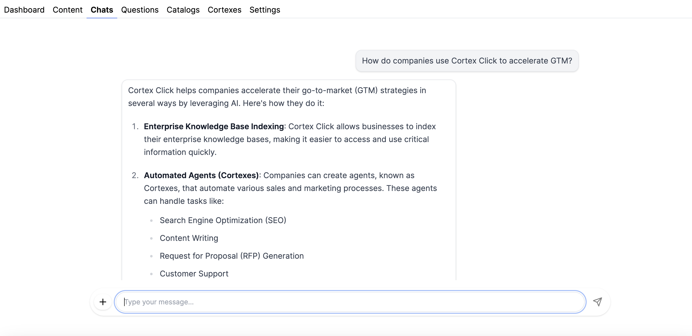

# Cortex Click Node.js SDK

Requires Node.js v20+

```
npm install @cortexclick/cortex
```

The Cortex SDK let's you automate sales and marketing scenarios and accelerate your go-to-market (GTM) motion with AI.

`cortexes` are AI agents that you can configure with custom instructions for various sales and marketing workflows. Cortex Click provides seemless integration with all of you internal GTM data. Index your data into the platform, and make it available to `cortexes` to increase the quality of generated content. Including built-in indexers for:

- JSON and other structured data
- Marketing/docs websites (markdown)
- Internal documentation, and GTM materials (docx files)
- Sales and marketing spreadsheets for things like RFPs, security questionaires, and pricing tables (TSV/CSV)

Every chat and piece of generated content can be viewed in https://app.cortexclick.com. Each piece of content contains metadata about the user who created it, so you can observe questions that customers are asking, and what your sales and marketing team are focused on from a single pane of glass.

Write SEO optimized blog posts:

```ts
import { CortexClient } from "@cortexclick/cortex";

const client = new CortexClient({
  accessToken: process.env.CORTEX_ACCESS_TOKEN || "",
  org: "ACME",
});

// cortexes are AI agents configured with specific rules and data sets
// and customized for specific jobs like content writing, support, and sales.
const cortex = await client.getCortex("content-writer");

// generate SEO optimized blogs with in a few lines
const content = await cortex.generateContent({
  title: "A Hard-Hitting Analysis: Comparing the Toughest Anvils on the Market",
  prompt: `Write a blog post comparing various anvils on the market. ACME's product line should be favorably represented. Be sure to give an alanysis of various anvil materials such as steel, and wrought iron.
        `,
});

// edit the blog with AI
await content.refine({
  prompt:
    "Add a table comparing weights of various anvils after the first paragraph",
});

// retrieve the markdown and host it on your docs platform of choice
fs.writeFileSync("./anvil-blog.md", content.content);
```

Build custom support agents:

```ts
const cortex = await client.getCortex("support-engineer");

// ask questions and stream responses
const streamingChatResponse = await cortex.chat({
  message: "What kind of hammers are best to use on my ACME anvil?",
  stream: true,
});
streamingChatResponse.responseStream.on("data", (data) => {
  process.stdout.write(data.toString());
});

const chat = await streamingChatResponse.chat;

// respond to chats maintaining memory of previous responses
const respondResponse = await chat.respond({
  message: "Is it safe to use my copper mallet hammer on my anvil?",
  stream: true,
});
respondResponse.responseStream.on("data", (data) => {
  process.stdout.write(data.toString());
});

await respondResponse.chat;
```

And much more!

Once `cortexes` and `catalogs` are configured, you can use them programmatically through the SDK, or generate content and engage in chat through https://app.cortexclick.com

Chat:



Content Authorship:


## Concepts & Reference

Cortex Click makes it easy to create customized AI workflow for GTM tasks. This is accomplished through:

- `cortexes`: AI agents configured with custom instructions and data sets.
- `catalogs`: Sets of data indexed into the platform and made available to `cortexes` at runtime to improve the quality of generated content.
- `indexers`: Convenient utilities for importing data of various kinds (markdown, tsv, shopify product catalogs, text, docx, spreadsheets) into `catalogs`.
- `content`: A set of APIs for generating and iterating on long-form prose (blog posts, messaging, marketing emails)
- `chat`: A set of APIs for Q&A - commonly used to build support workflows, and internal help desks.

### Cortexes

A `cortex` is an AI agent that can be customized through a simple interface:

- `instructions`: A set of steps that describe the task, including rules to follow, dos and dont's.
- `catalogs`: Data sets indexed in the Cortex Click platform that the agent has access to at runtime.
- `personality`: Customized tone of voice specific to your brand and vertical.

```ts
// configure organization-level defaults
await client.configureOrg({
  companyName: "Temporal",
  companyInfo:
    "ACME is a purveyor of various novelty props including anvils and dynamite.",
  personality: ["approachable", "knowledgeable", "expert blacksmith"],
});

// configure a cortex for a specific job:
const cortex = await client.configureCortex("slack-support", {
  // data sources that this cortex has access to when generating responses
  catalogs: ["docs", "previous-support-cases"],
  friendlyName: "ACME Support",
  instructions: [
    "You will recieve messages from users that are asked via Slack. Respond to their questions to the best of your ability.",
    "When appropriate, provide links to help articles",
    'If you cannot answer a question, or sense that the user becomes frustrated, send a reponse with "@acme-support please engage"',
  ],
  public: true,
  customizations: {
    rules: ["never offer any discounts or information on pricing"],
  },
});
```

You can create multiple customized Cortexes for various GTM, sales, marketing, and support scenarios.

### Catalogs

Catalogs are sets of data that are indexed into the platform and can be made available to Cortexes at runtime to dramatically improve the quality of generated content and responses.

```ts
const catalog = await client.configureCatalog("docs", {
  description:
    "This data source contains highly accurate human authored documentation from the acme.com website.",
  instructions: [
    "prefer this data source over all others",
    "use this data source to answer questions about products and how they can be used effectively",
  ],
});
```

Once you've created a Catalog you can index documents into it. Indexed documents are chunked, optimized for content and Q&A, stored in a vector storage engine, and made available at runtime to Cortexes.

Documents have three special fields:

- `id`: required identifier to address this document for subsequent update and deletion
- `url`: optional reference URL. When provided, content and chat generation will cite this field by including frienly markdown links into the generated content.
- `imageUrl`: optional image. When appropriate, content and chat will embed markdown images in the output.

Including `url` and `imageUrl` will result in more engaging and higher-performing generated content, and should be provided whenever possible.

Markdown example:

```ts
const docs: TextDocument[] = [
  {
    documentId: "1",
    contentType: "markdown",
    content: "# some markdown",
    url: "https://foo.com",
    imageUrl: "https://foo.com/image.jpg",
  },
  {
    documentId: "2",
    contentType: "markdown",
    content: "# some more markdown",
    url: "https://foo.com/2",
    imageUrl: "https://foo.com/image2.jpg",
  },
];

await catalog.upsertDocuments(docs);
```

JSON example:

```ts
const docs: JSONDocument[] = [
  {
    documentId: "1",
    contentType: "json",
    content: {
      foo: "buzz",
      a: [5, 6, 7],
    },
    url: "https://foo.com",
    imageUrl: "https://foo.com/image.jpg",
  },
  {
    documentId: "2",
    contentType: "json",
    content: {
      foo: "bar",
      a: [1, 2, 3],
    },
    url: "https://foo.com/2",
    imageUrl: "https://foo.com/image2.jpg",
  },
];

await catalog.upsertDocuments(docs);
```

### Indexers

Indexers are convenient ways to index common data formats in bulk.

#### JSON

Index JSON in bulk:

```ts
const items = JSON.parse(fs.readFileSync(`./data/items.json`).toString());

const catalog = await client.get("json-data");
const indexer = catalog.jsonIndexer(schemaItems);
await indexer.index();
```

By default, the indexer will extract out `id`, `url`, and `imageUrl` fields, but there are also options to provide custom mapping to these fields.

#### Directory Indexer

You can point the directory indexer at a local directory on your machine and upload all markdown, JSON, text, and docx files within that directory. This is great for uploading GTM materials from Google Drive, and indexing developer documentation in a GitHub repo. The directory indexer is commonly run in GitHub Actions merge workflows to keep content up to date.

```ts
const indexer = catalog.directoryIndexer({
  // path to local directory
  rootDir: "/Users/evan/code/allium-docs",
  // the base URL of your documentation website - used to assmeble URLs automatically
  urlBase: "https://acme.com/docs",
  includeFile(filePath) {
    if (filePath.endsWith("SUMMARY.md")) {
      return false;
    }
    return filePath.endsWith(".md");
  },
  // customize how URLs are extracted
  getUrl,
  // customize how IDs are extracted
  getId,
});

await indexer.index();
```

### TSV Indexer

TSV Indexer is used for uploading spreadsheets into the platform.

```ts
const indexer = catalog.tsvIndexer(
  // file to index
  "/path/to/file.tsv",
  {
    // select and map columns to include
    fieldMapping: {
      id: "id",
      title: "title",
      description: "description",
      price: "price",
      brand: "brand",
      image_link: "imageUrl",
      link: "url",
      product_type: "productType",
      google_product_category: "category",
      color: "color",
      gender: "gender",
    },
  },
);
```

#### Shopify Indexer

Users common build e-commerce recommencation engines with Cortex Click. The Shopify indexer can load your product catalog into the platform. All you need to provide is your store URL:

```ts
const indexer = catalog.shopifyIndexer({
  shopifyBaseUrl: "https://yourShopifyStore.com",
});
await indexer.index();
```

## Cortex Click App

https://app.cortexclick.com gives you a single pane of glass for configuring Cortexes, Catalogs, Chat, and Content through a simple UX. Every Cortex comes with a rich content editor, and a chat interface made available to all of your employees. Cortexes can also be marked as `public` so that you can use our embedded chat UX in your existing public facing docs and support properties.

So far customer's are using public cortexes for things like:

- First line customer support
- Replacement/augmentation for documentation search
- Product reccomendations on e-commerce websites

Internal cortexes are typically used for:

- Writing SEO optimized content and blog posts
- Answering security questionaires (SOC2, SLDC, etc)
- Generating pricing quotes
- Drafting domain-specific outbount messaging
- RFP generation

Every chat and piece of generated content can be viewed in the app, along with search and filters that let you drill down by internal employee and external customer. A complete view of your business, and the questions that both your users and employees are bringing to the table.

If you'd like to onboard, email contact at cortexclick dot com.

## How it Works

Cortex Click combines state of the art models from multiple major LLM and AI providers. Different models have different strengths. Some are better at reasoning and generating code, and some are better at writing aesthetically pleasing prose.

Our content generation workflows combine multiple models. When we need to generate code, we pick the best model available for that job. When we need to write compelling marketing copy, we chose that model.

In addition, bringing your own data to LLMs is the single best way to improve the quality of output. We make it easy to bring your own data, and combine that with real time research from the web to make sure that generated content and chat responses are of the utmost levels of quality.

## Contributing

We welcome contributions!

### Running Tests

This repo uses `vitest` to run tests.

**NOTE**: some of these test hit Cortex Click endpoints for content and chat generation that consume credits.

To run tests you'll need to set the following environment variables:

1.  `CORTEX_ORG`: The name of your Cortex Click org. Tests will be run under this account.
1.  `CORTEX_ACCESS_TOKEN`: The access token (org or personal) used to authenticate with the Cortex API.

There are two test targets:

1. `npm run test` run the full suite of test in watch mode
2. `npm run test:fast` a faster version of the suite that skips longer running tests (like content generation).
